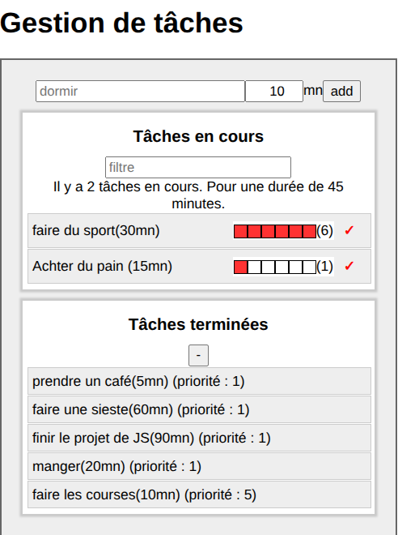

# Task App



## Description

Task App est une application de gestion de tâches développée en React. Elle permet d'ajouter, visualiser, marquer comme terminées et prioriser des tâches facilement.

## Technologies utilisées

- **React** : pour la création des composants interactifs
- **JavaScript** : logique de l'application
- **CSS** : pour le style des composants
- **Webpack** : pour le bundling et le développement

## Fonctionnalités principales

- Ajouter une tâche
- Marquer une tâche comme terminée
- Gérer le niveau de priorité
- Visualiser la liste des tâches à faire et faites

## Lancer l'application

1. Installer les dépendances :
   ```bash
   npm install
   ```
2. Démarrer le serveur de développement :
   ```bash
   npm start
   ```
3. Ouvrir votre navigateur à l'adresse :
   ```
   http://localhost:3000
   ```

## À quoi sert l'application ?

Task App vous aide à organiser vos tâches quotidiennes, suivre leur avancement et gérer leur priorité pour une meilleure productivité.

---

Ajoutez une capture d'écran nommée `screenshot.png` à la racine du projet pour l'afficher dans ce README.
